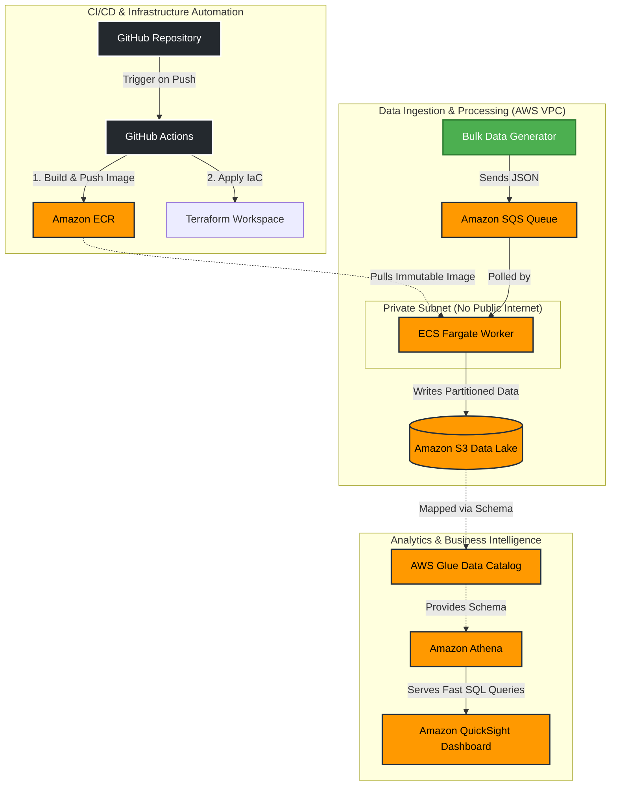

# 🛡️ Public Sector Serverless Data Ingress Platform

An enterprise-grade, fully automated data ingestion and analytics platform built on AWS. This project demonstrates a complete end-to-end cloud architecture—from GitOps-driven infrastructure to serverless data processing and visualized business intelligence.

## 🏗️ Architecture Overview

The platform is designed to securely ingest high-velocity telemetry or operational data, buffer it, process it via isolated serverless containers, and store it in an analytics-ready Data Lake. 




## 🛠️ Technology Stack & Reasoning
This project utilizes modern cloud design patterns to ensure security, scalability, and cost-efficiency.

### 1. Infrastructure & CI/CD (GitOps)
Terraform: Used to define every piece of AWS infrastructure as code (IaC). This ensures environments are reproducible, auditable, and self-documenting.

GitHub Actions: Automates the deployment pipeline. Every code push automatically builds a new Docker image tagged with the specific Git Commit SHA, pushes it to AWS, and runs terraform apply. This guarantees what is running in the cloud perfectly matches the source code.

Amazon ECR (Elastic Container Registry): securely stores our immutable Docker images.

### 2. The Ingestion Buffer
Amazon SQS (Simple Queue Service): Acts as a shock absorber. Instead of writing data directly to a database (which can crash during traffic spikes), data hits SQS first. SQS holds the messages safely until the worker is ready to process them.

### 3. Secure Serverless Compute
Amazon ECS (Fargate): Runs our Python worker script without the need to manage underlying EC2 servers.

Zero-Trust Network Isolation: The Fargate task runs in a Private Subnet. It has no public IP address and cannot be accessed from the internet. It only communicates outward via a NAT Gateway.

Least Privilege IAM: The worker is assigned a specific IAM Task Role that only allows it to read from the exact SQS queue and write to the exact S3 bucket.

### 4. The Data Lake & Analytics Engine
Amazon S3 (Simple Storage Service): Stores the raw JSON payloads.

Hive-Style Partitioning: The Python worker logically organizes files into folders by date (e.g., /year=2026/month=07/day=15/). This drastically reduces cloud storage costs and speeds up query times.

AWS Glue & Amazon Athena: Athena overlays a SQL querying engine directly on top of the S3 text files. By implementing Partition Projection, Athena mathematically calculates where data lives rather than running expensive directory scans, resulting in lightning-fast, serverless queries.

Amazon QuickSight: Connects to a dedicated Athena Workgroup to visualize the data lake through interactive, executive-level BI dashboards.

## 🚀 How Data Flows Through the System
Generation: A bulk ingest script generates thousands of mock telemetry records (representing different government departments and security clearances) and pushes them to SQS in batches.

Polling: The ECS Fargate container constantly polls SQS. When messages arrive, it pulls them down securely.

Processing: The worker parses the JSON, extracts the timestamp, and formats it for storage.

Storage: The worker writes the file to the S3 Data Lake, placing it in the correct year/month/day directory.

Visualization: QuickSight queries Amazon Athena, which reads the partitioned S3 files on the fly to render real-time charts and metrics.

## 💻 Repository Structure

```text
aws-ps-ingress-platform/
├── .github/workflows/
│   └── deploy.yml          # GitHub Actions CI/CD Pipeline
├── app/
│   ├── requirements.txt    # Python dependencies for the worker
│   └── worker.py           # Core ECS Fargate queue processing script
├── terraform/              # Infrastructure as Code (IaC)
│   ├── athena.tf           # Glue Catalog, Athena Tables, Partition Projection
│   ├── datalake.tf         # S3 Data Lake configurations
│   ├── ecr.tf              # Elastic Container Registry setup
│   ├── ecs.tf              # ECS Cluster, Task Definitions, and IAM Roles
│   ├── oidc.tf             # Secure GitHub-to-AWS OpenID Connect trust
│   ├── providers.tf        # AWS Provider & backend variables
│   ├── resource-groups.tf  # Logical resource grouping
│   ├── sqs.tf              # SQS Ingestion Queue setup
│   ├── variables.tf        # Variable declarations
│   └── vpc.tf              # VPC, Subnets, Gateways, Routes
├── .gitignore              # Files ignored by Git (such as terraform.tfstate)
├── bulk_ingest.py          # Development script to flood the queue with telemetry
├── dashboard.py            # Local Streamlit data visualization application
├── msg.json                # Local sample event payload
└── msg2.json               # Local sample event payload
```

## ⚙️ Setup & Deployment
This project is deployed entirely via GitHub Actions. To replicate this environment:

Configure AWS OIDC or store AWS_ACCESS_KEY_ID and AWS_SECRET_ACCESS_KEY in GitHub Repository Secrets.

Push the code to the main branch.

The GitHub Action will build the infrastructure, deploy the container, and start the ingestion worker automatically.